# GoCheer: selected word translator with achievement system

>1452764 何冬怡　15502131257　me@donggu.me  
1452769 张鸿羽  
1350588 胡贝妮  
1452661 冯⾬晴

## System Functionalities
- **Download GoCheer**  
	After entering `http://gocheer.donggu.me` (the official website of GoCheer) in Chrome, users can click the "download GoCheer" button to download `GoCheer.crx`.  

- **Register a new user**    
	Users can register a new user in `http://gocheer.donggu.me/signup.jsp`. Users are required to enter a user name, password, gender, nickname and email. All of these information has formatting requirements. What's more, we will determine whether this user name already exists.  

- **Log in & Log out**    
	Users can log in or log out both in web page and in GoCheer Chrome extension.  

- **Display user information in GoCheer Chrome extension**  
	If a user logs in successfully in GoCheer Chrome extension, he can see their nick name, the number of words he has searched, the number of his achievements and his score.

- **Jump to User Home and Leaderboard**  
	Users can jump to User Home and Leaderboard directly.

- **User Home Page**
	- **User Achievements**    
		Users can see their achievements in their own Home Page. 

	- **User history**    
		Users can see their searching records in their own Home Page. 

	- **Personal information**    
		Users can see their detailed information in their own Home Page.  

	- **Modify personal information**    
		Users can modify their personal information (except user name) in their own Home Page.  

- **View real-time leaderboard**    
	Users can view the real-time score leaderboard `http://gocheer.donggu.me/leaderboard.jsp`. Users can directly go to thier position.  

- **View other users' Home Page**    
	Users can view other users' Home Page through the Leaderboard. In order to protect users' privicy, if a user(A) enter another user(B)'s Home Page, A can not see B's email address or searching history. Of course, A can not modify B's personal settings either.  

- **Select words and get meaning**    
	As long as the user is logged in, he can select words at any web page in Chrome, then results will appear next to the selected word. The source of the results is YouDao.  

- **Notification popups for achievements**    
	Users can see a notification popup in the current web page when they get a new achievement.  

- **Notification email for new achievements**    
	If a user get a new achivement, he will also receive an notification email.  

## User Manual
- **Google Chrome** browser needs to be installed in your machine.  

- Please go to 
[http://gocheer.donggu.me](http://gocheer.donggu.me) and download `GoCheer.crx`.  

	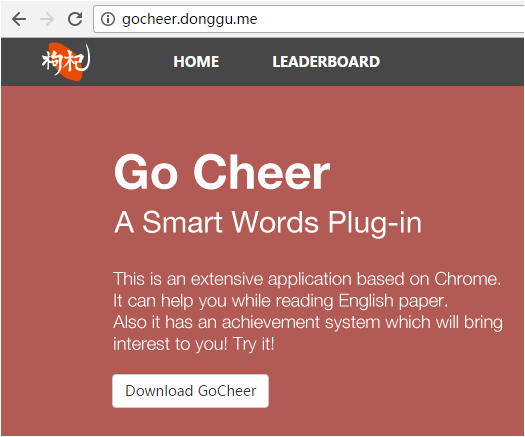  

- Open `chrome://extensions/` and drag the `GoCheer.crx` into it.  

	  

	> P.S. If you find the GoCheer Chrome extension can not be enabled properly, you can try to clear your browsing data, reboot your brower and install again.  

- If you have installed the plugin correctly, you will see this icon at the upper right corner of Chrome.  
	
	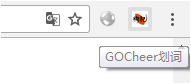  

- Click the GoCheer icon and you will see the Login Page.  
	
	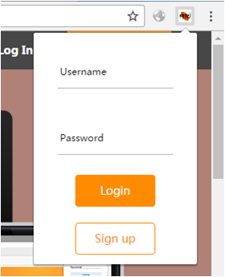  

- Click the "Sign up" button and go to the Sign up Page.  
	
	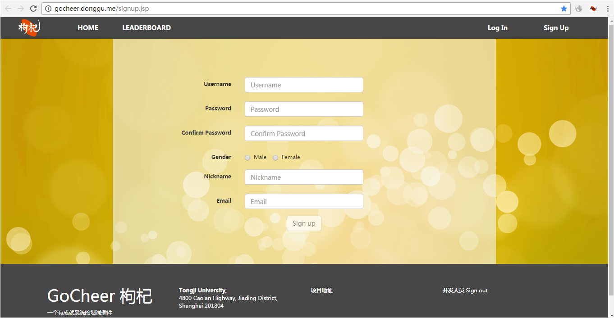  

- Fill in your information and submit.  
	
	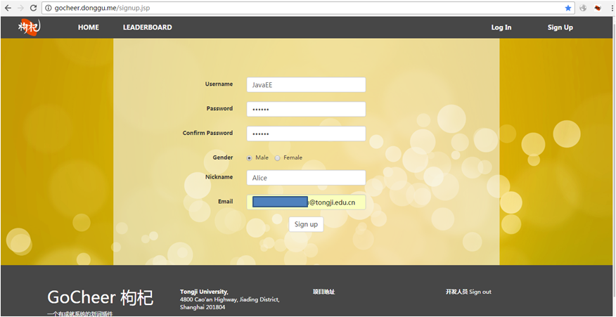  

- After registering successfully, you will jump to your Home Page automatically.  
	
	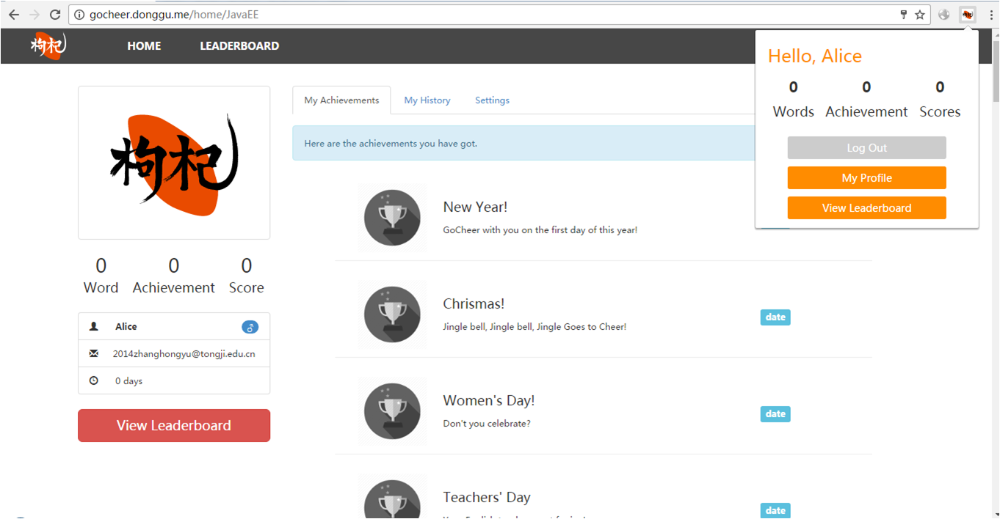  

- Then you can select a word.  
	
	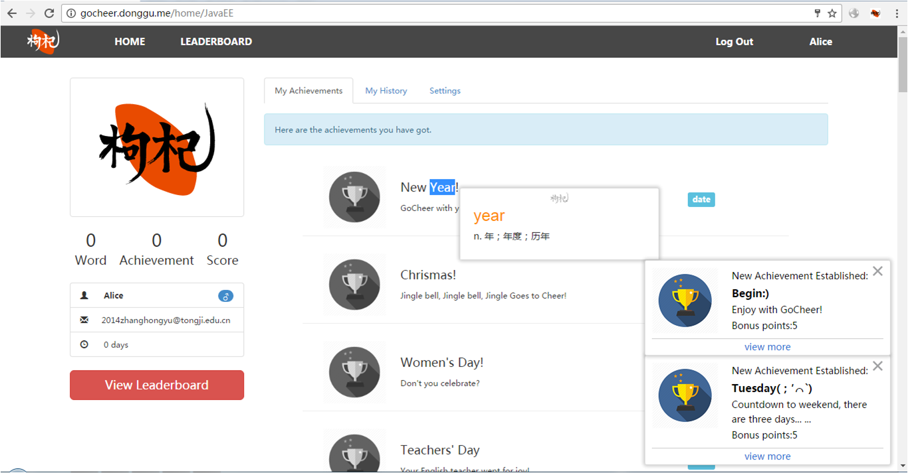  

- If you get a new achievement, you will receive an email from GoCheer.  
	
	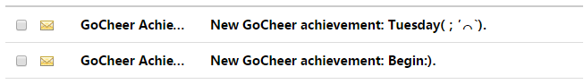  

- You can go to your Home Page and see your history and achievements. 
	
	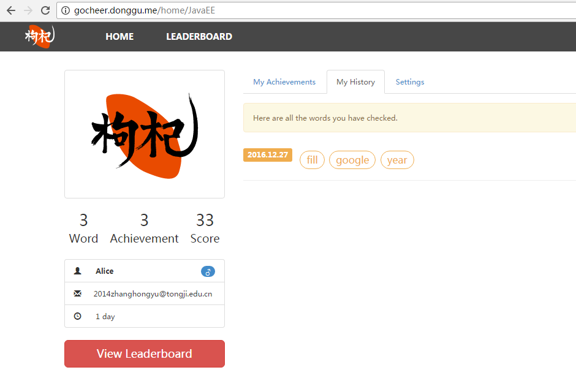  

	  

- You can also change your information in your Home Page.  
	
	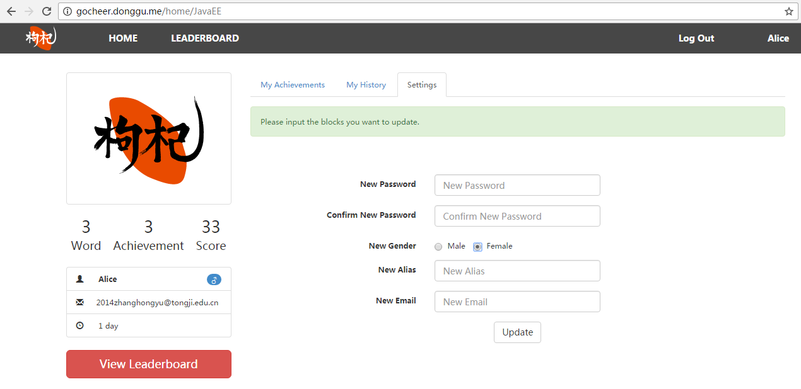  

- Click the "Leaderboard" and you can see the score ranking of all GoCheer users.  
	
	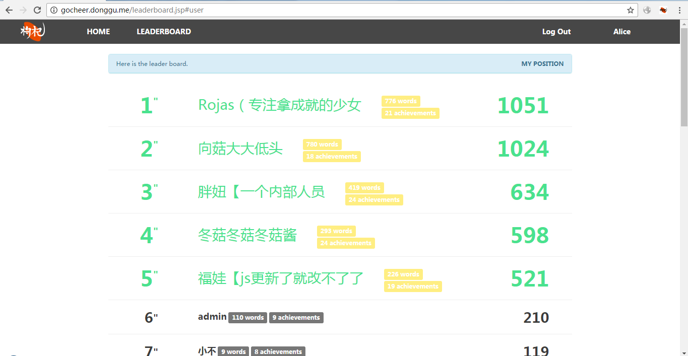  

- Click "my position" and you can go to your position directly.  
	
	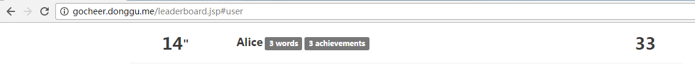  

## System Deployment and Configurations
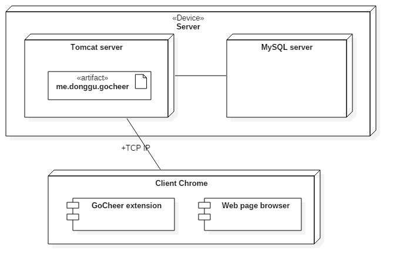  
In back-end we have our Java EE artifact in tomcat server which connects to MySQL database in the same Linux server.  
In fore-end, Google Chrome browser needs to be installed in client machine, and add our extension in it.   
User can view the system via web pages and the extension window. Web pages are provided by **JSP pages** which deployed in tomcat server, while the extension communicates with back-end via **ajax HTTP request**, and the server responses data in `JSON` format (See also <a href="#appendix-3-api-list">API list</a> in appendix). The extension is built with `HTML`, `CSS` and `JavaScript`.

## System Architecture
### Package Diagram
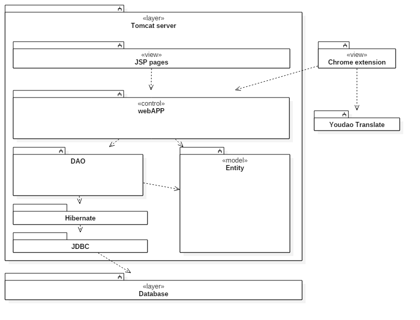  
The architecture of GoCheer server is clear and not sophisticated.  
We use JDBC to connect to our MySQL server, and use **Hibernate ORM** to map our database schema to classes in **Entity**.  
We encapsulated all **CRUD** and other operation which conserns Hibernate or database in our **DAO** package, so other layers can consider about the logic only.  
In **webAPP** we have all our servlets and filter to process requests, and we have JSP pages as well as our extension as our View layer. 

### Entity
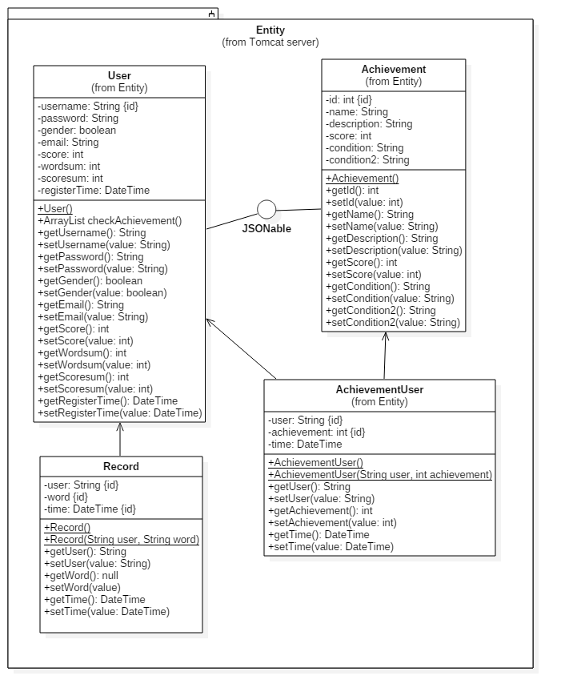  
We have these classes mapping to the schema in Database. And this two classes provided a interface `JASONable`, to generate a JSON object as a response to request from extension. We also have our business logic here.

### DAO
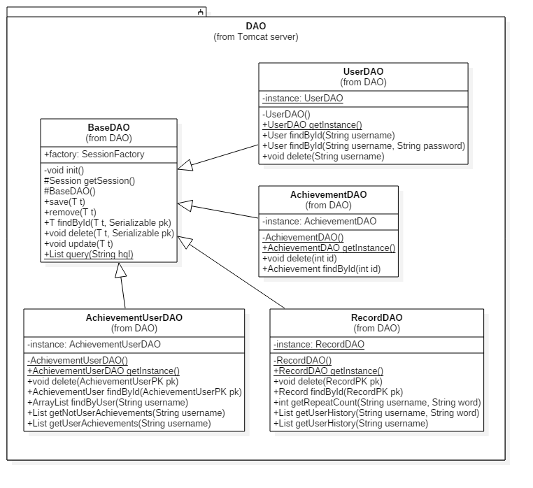  
BaseDAO is a generic class. It can manage databse connect session and transaction, and it realized **CRUD** methods.   
Other 4 DAO classes inherit from the corresponding class instance of BaseDAO (e.g. `UserDAO` extends `BaseDAO<User>`). They are all singleton and we ensured they are **thread-safe**. Some other methods that involved with database query are added into these classes. When using **HQL** to make query, named parameter is used to **prevent databse from SQL injection**.  

### webAPP
In webAPP package there are servlets and filters. A **CharcterEncodingFilter** is deployed to ensure the character encodings of all requests and responses are **UTF-8**. Servlets process requests and return responses.

## Component design
### Detect achievement
Once selecting a area of word, the method of `/newRecord` is called. The method of GET is called, and the parameter `word` is the content of the selected word. Text-transform and space are both available.  

This interface changes all words to lowercase, and processes match and analysis by using regular expression. If the selected word is available, this word is added into the record of searching. If it is a long sentence, it would not add in the history. In a word, the user could get scores if the word exists, and new achievements are checked whether the user can get. If users can get new achievements, the format of returned value is `json`. 

### Sign in/Log in/Log out
- **sign in**  
Once a user fills out the enrollment form, and clicks the button of `sign in`, the method of `/Signin`  is called, and if the user registers successfully, the related information is saved in the session, passed while dispatching a request and calling the method of `Login`. Thereinto, in order to make sure the username is unique to maintain the consistence of the database, the method of `/checkUsername` is called to check whether the username is available to register.

- **log in**  
while logging in, the method of `/Login` is called. If the request is from plugin, the parameter `extension` is `true`, else this key isn't needed. Besides, the returned value is `true` while logging in successfully, otherwise it is `false`, if the request is from plugin. 

- **log out**  
 If the user tempts to log out, the method of `/Logout` is called. If the request is from plugin, the parameter `extension` is `true`, else this key isn't needed. 

- **Send E-mail**  
While calling the method of `/newRecord`, if a new achievement is checked to be obtained, the function of `sendCongratulation(user, achievement)` is applied to send an e-mail via SMTP server. We send the emails to the users with the SMTP service provided by **Mailgun**.

## Database design
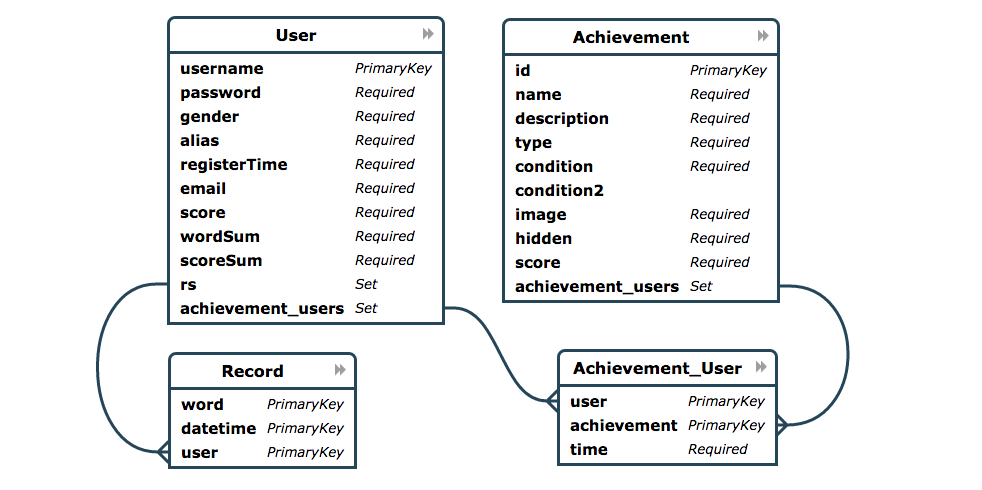  

- Three extra attribute **wordSum**, **scoreSum** and **score** are added to User, to reduce cost of getting the score, the times of user making a search, and the total amount of achievements the user has got.  
- In table **Achievement** there is a attrubute "type" to decide what kind of achievement it is, how the system read value of `condition` and `condition2`, and to decide how the system judges whether a user has got this achievement. In this way, system administrator can add achievements to the database more flexibly.

# Appendix
## Appendix 1: Achievement logic
Achievement items are saved in the database in order to add new achievement or update existed ones.  The logic of achievement judging is listed as followed:  

- **wordsum**  
	The achievement is related to the sum of words, which are searched via GoCheer achievement system. In other word, users can get the specific achievement by having looked up a set amount of words.

- **specific word**  
	The achievement is related to some specific words, such as 'Naive', 'Excited' and 'Java'. Users can get the achievement when they exactly select the specific word set in the system.

- **day**  
	The achievement can be get when users look up some word on a specific day, which is set according to what day it is. For example, the users can get the "Friday" achievement, when they look up a word on Friday.

- **date**  
	The achievement can be get when users look up some word on a specific day, which is set according to what the date it is. For example, the users can get the "Valentine" achievement when they look up a word on Feb 14th.

- **time**  
	The achievement can be get when users look up some word at a specific time. For example, the users can get the "Zero" achievement when they look up a word at 0 o'clock.

- **duration & repeat count**  
	The users can get this kind of achievement only when they repeat searching the same word during a certain period of time. For example, the user can get the "Amnesia" achievement when they repeat searching a word in one hour for ten times.

- **duration & wordsum**  
	The users can get this kind of achievement only when they have looked up a set amount of words during a certain period of time. For example, the user can get the "Loyal customer" achievement when they have looked up one hundred words in one hour.

- **repeat count**  
	The achievement can be get when users repeat searching a same word for a set amount of times. For example. users can obtain the "Amentia" achievement when they have looked up a same word for one hundred times.

- **day & time**  
	The achievement is related to the concept of day and time. Users only can get the definite achievements when they select a word at a specific time and on a specific day. For example, the user can get the "Lonely" achievement when they look up a word at 22 o'clock on Friday.

- **date & wordsum**  
	The achievement is related to the date and the sum of words. Users can get the accord achievement when they have looked up a set amount of words on a specific day. For example, Users can get the "Dreary" achievement when they have searched 100 words on Feb 14th, the Valentine Day.

- **date & time**  
	The achievement is related to date and time. Users can get the accord achievement when they search a word at a specific time and on a set day. For example, users can get the "Eve" achievement when users select a word at 0 o'clock on Jan 1.

- **date & specific word**  
	The achievement can be get when users look up the specific word on a set day. For example, users can get "Dreary" achievement when they have looked up one hundred words on Feb 14th, the Valentine Day. 

## Appendix 2: Achievement list
|id |name |description |type |condition |condition2 |hidden |score |
|---|-----|------------|-----|----------|-----------|-------|------|
|1|Begin:)|Enjoy with GoCheer!|wordsum|1||0|5|
|2|Naive!|Too young, sometimes naive.|specific word|naive||1|20|
|3|JAVA EE|I love JAVA EE！JAVA EE makes me HAPPY!|date & specific word|java||1|100|
|4|Excited!|Are you excited?|specific word|exited||1|20|
|5|Skilled!|You're catching on!|wordsum|15||0|10|
|6|Hundred!|What a milestone event!|wordsum|100||0|10|
|7|Lonely;(|Lonely man on Friday night!|day & time|FRIDAY|22|0|5|
|8|New Year!|GoCheer with you on the first day of this year!|date|0101||0|!5|
|9|Chrismas!|Jingle bell, Jingle bell, Jingle Goes to Cheer!|date|1225||0|15|
|10|Women's Day!|Don't you celebrate?|date|0308||0|15|
|11|Teachers' Day|Your English teacher wept for joy!|date|0910||0|15|
|12|Valentine|Don't cry, GoCheer loves bachelors!|date|0214||0|!5|
|13|Zero!|One day one word, keep sleep away!|time|0||0|5|
|14|Energetic!|Get up early? OR Still stay up?!|time|3||0|5|
|15|Monday Blue!|Go to work, Go to die!|day|MONDAY||0|5|
|16|Nerd!|Come on, it is Saturday!|day|SATURDAY||0|5|
|17|Cheerful!|Glad to meet you on Sunday!|day|SUNDAY||0|5|
|18|Dreary!|You know, 100 words cannot changed for a girlfriend,,, ,,,|date & wordsum|0214|100|0|50|
|19|Eve!|The bell sounding the New Year is ringing!|date & time|0101|0|0|100|
|20|Hard Work!|Unexpectedly, you are still studying!|time & wordsum|0|100|0|40|
|21|Honey!|Who is your honey?|date & specific word|0214|honey|0|30|
|22|Amnesia?|You repeat a word for 10 times in one hour... ...|duration & repeat count|1|10|0|0|
|23|Amentia|You have looked up for a same word for 50 times... ...|repeat count|50||0|0|

|id |name |description |type |condition |condition2 |hidden |score |
|---|-----|------------|-----|----------|-----------|-------|------|
|24|Loyal customer!|You have selected 100 words in one hour!|duration & wordsum|1|100|0|10|
|25|Motherland|Are you kidding me?|specific word|china||1|20|
|26|Bonus!|Congratulations on selecting a score word!|specific word|bonus||1|20|
|27|404 /(ㄒoㄒ)/~~|So..., you are a Baidu-er?|specific word|google||1|20|
|28|Achievement Obtained！|Ugh,GoCheer is a cheerful ACHIEVEMENT system。|specific word|achievement||1|20|
|29|Tuesday(；′⌒`)|Countdown to weekend, there are three days... ...|day|TUESDAY||0|5|
|30|Honourable|Honourable Administrator is watching you. :)|specific word|1|donggu||20|
|31|IDEMOOO!|Novake Djokovic, a musical talent, is watching you.|specific word|serbia||1|20|
|32|( ゜- ゜)つロ|Cheer!|specific word|gocheer||1|20|
|33|Being ready for exam?|How is your CET4 going?|specific word|abandon||1|0|
|34|Thousand :D|You have looked up for a thousand words via GoCheer!|wordwum|1000||0|40|
|35|Fatal error......|Maybe you should turn to Stack Overflow......|specific word|exception||1|10| 

## Appendix 3: API list

### Log in  `/Login` 
    gocheer.donggu.me/Login
    form-data:
        username: <username>
        password: <password>
        extension: <extension>
        
The method of POST is called, and if the request is from plugin, the parameter `extension` is `true`, else this key isn't needed. Besides, the returned value is `true` while logging in successfully, otherwise it is `false`, if the request is from plugin.  

### Log out  `/logout` 
    gocheer.donggu.me/logout
    form-data:
        extension: <extension>

The method of POST is called, and if the request is from plugin, the parameter `extension` is `true`, else this key isn't needed. 

### Alter the user's information  `/update`
    gocheer.donggu.me/update
    form-data:
        alias: <new alias>
        password: <new password>
        email: <new email>
        gender: <new gender>
        
The method of POST is called, and it is available when some items in the form aren't filled in. The type of parameter `gender` is bool, and male represents `true` and female stands for `false`.

### Check whether the username is occupied   `/checkUsername`
<!-- #### method call： -->

  gocheer.donggu.me/checkUsername?username=<待检测用户名>

The method of GET is called, and the returned value is `false` or `true` in the form of `json`. Thereinto, `false` means this username has been occupied, and `true` means this username is available to register.  


### Obtain user's basic information `/userInfo`
<!-- #### method call： -->

  gocheer.donggu.me/userInfo?username=<username>

The method of GET is called, and the type of returned value is `json`. The subsequent parameter is option, and the default user is the currently logged-in user.

#### sample 
##### 1. Obtain user's basic information（currently-logged-in user）
  gocheer.donggu.me/userInfo
``` json
{
  "user": {
    "score": 9,
    "gender": false,
    "wordsum": 9,
    "registerTime": "2016-12-11 14:15:01",
    "alias": "j2ee",
    "scoresum": 0,
    "email": "hhhhhh@hh.com",
    "username": "JavaEE"
  }
}
```

##### 2. Obtain user's basic information（currently non-logged-in user）
  gocheer.donggu.me/userInfo
``` json
{
  "user": null
}
```

##### 3. Obtain user's basic information（specified user)
The function is to show a user other users' information, and the returned json doesn't include e-mails unless in the flesh.  

  gocheer.donggu.me/userInfo?username=<targetusername>
``` json
{
  "user": {
    "score": 0,
    "gender": false,
    "wordsum": 0,
    "registerTime": "2016-12-11 14:01:21",
    "alias": "枸杞儿",
    "scoresum": 0,
    "username": "gocheer"
  }
}
```

### Add the record of query `/newRecord`
<!-- #### method call -->

  gocheer.donggu.me/newRecord?word=<word>
  
The method of GET is called, and the parameter `word` is the content of the selected word. Text-transform and space are both available.  

#### specification
This interface changes all words to lowercase, and processes match and analysis by using regular expression. If the selected word is available, this word is added into the record of searching. If it is a long sentence, it would not add in the history. In a word, the user could get scores if the word exists, and new achievements are checked whether the user can get. If users can get new achievements, the type of returned value is `json`. 

#### sample
##### 1. Obtain a new achievement
Given that user may obtain more than one achievement, the achievements is in a list.

``` json
{
  "achievement": [
    {
      "image": "default.png",
      "hidden": false,
      "name": "Begin",
      "bonus": 5,
      "description": "Enjoy with GoCheer!",
      "id": 1
    }
  ]
}
```

##### 2. Obtain no achievement
``` json
{
  "achievement": null
}
```

##### 3. Haven't logged in
``` json
{
  "error": 1,
  "message": "Haven't log in"
}
```

##### 4. No available word from the parameter
``` json
{
  "error": 2,
  "message": "No available words."
}
```

## Appendix 4: Team collaboration
### Division of work
- **1452764 何冬怡  Leader**  
	- System architecture design  
	- Schedule management and process control  
	- Back-end development  
	- Part of fore-end pages

- **1452685 陈冉冉**  
	- Back-end development  
	- Database maintenance  
	- Mailing service
	- Part of fore-end pages

- **1452769 张鸿羽**
	- Chrome extension development
	- Part of fore-end pages

### Source code management
- GitHub organization: [https://github.com/GoCheerJava](https://github.com/GoCheerJava)
	- Server-side repo: [GoCheerJava/GoCheer_Server](https://github.com/GoCheerJava/GoCheer_Server)
	- Chrome extension: [GoCheerJava/GoCheer](https://github.com/GoCheerJava/GoCheer)
